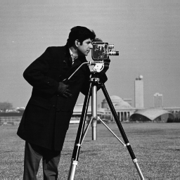

# Image Dithering 

## Overview

Implements error diffusion dithering on grayscale images. It reduces the number of gray levels in an image while maintaining visual quality through error diffusion. Can process multiple images with varying numbers of gray levels.

## Error Diffusion

Error diffusion is a technique used in image processing to reduce the color palette of an image while maintaining its visual quality. It's particularly useful for converting grayscale images with many shades to images with fewer shades, such as for display on devices with limited color capabilities.

### How Error Diffusion Works

1. For each pixel in the image:
   a. Find the closest available color (in this case, gray level) for the current pixel.
   b. Set the pixel to this new color.
   c. Calculate the error (difference) between the original color and the new color.
   d. Distribute this error to neighboring pixels that haven't been processed yet.

2. The error distribution is typically done using a pattern. In this implementation, the Floyd-Steinberg dithering pattern is used:

```
   X   7/16
 3/16  5/16  1/16
```

Where X is the current pixel, and the fractions represent how the error is distributed to neighboring pixels.

### Implementation in the Code

The main error diffusion logic is implemented in the `error_diffusion` function:

```python
def error_diffusion(image, m):
    levels = np.array([0, 64, 128, 192, 255])[:m]
    height, width = image.shape
    output = np.zeros_like(image, dtype=float)

    for y in range(height):
        for x in range(width):
            old_pixel = image[y, x]
            new_pixel = quantize(old_pixel, levels)
            output[y, x] = new_pixel
            error = old_pixel - new_pixel

            if x + 1 < width:
                output[y, x + 1] += error * 7 / 16
            if y + 1 < height:
                if x > 0:
                    output[y + 1, x - 1] += error * 3 / 16
                output[y + 1, x] += error * 5 / 16
                if x + 1 < width:
                    output[y + 1, x + 1] += error * 1 / 16

    return output.astype(np.uint8)
```

## Input-Output Examples

The program processes three sample images with different numbers of gray levels:

1. "Lena" (lena.gif)
2. "Cameraman" (cameraman.jpg)
3. "Tungsten" (tungsten_original.JPG)

For each image, the program generates four dithered versions with 2, 3, 4, and 5 gray levels.

### Example: "Lena" image

Input: lena.gif (original grayscale image)

Outputs:
- lena_dithered_2_levels.png
- lena_dithered_3_levels.png
- lena_dithered_4_levels.png
- lena_dithered_5_levels.png

As the number of gray levels increases, the dithered image will appear closer to the original. With fewer levels, the dithering pattern becomes more pronounced, creating the illusion of more shades through the spatial distribution of pixels.

### Visual Effects

- 2 levels: The image will appear as a binary (black and white) image with a strong dithering pattern.
- 3 levels: You'll see black, white, and one mid-gray level. The dithering pattern is still quite visible.
- 4 levels: The image starts to show more subtle shading, with the dithering pattern becoming less obvious.
- 5 levels: The image will look closer to the original, with smoother transitions between shades.

The error diffusion technique helps maintain details and edges in the image even with a reduced number of gray levels, by strategically placing the available shades to create the illusion of a fuller range of tones.

## Examples

Here are some examples of the error diffusion dithering process applied to different images with varying numbers of gray levels.

### 1. Lena

#### Original Image:


#### Dithered Images:

| 2 Levels | 3 Levels | 4 Levels | 5 Levels |
|----------|----------|----------|----------|
|  |  |  |  |

### 2. Cameraman

#### Original Image:



#### Dithered Images:

| 2 Levels | 3 Levels | 4 Levels | 5 Levels |
|----------|----------|----------|----------|
|  |  |  |  |

### 3. Tungsten

#### Original Image:


#### Dithered Images:

| 2 Levels | 3 Levels | 4 Levels | 5 Levels |
|----------|----------|----------|----------|
|  |  |  |  |

As you can see from these examples:

1. With just 2 levels (black and white), the dithered images retain a surprising amount of detail and remain recognizable.
2. As the number of levels increases, the image quality improves and the dithering pattern becomes less noticeable.
3. The error diffusion technique is particularly effective at preserving edges and important features in the images.
4. Even with only 5 levels, the dithered images appear quite close to the originals, demonstrating the effectiveness of this technique.

## Functions

### In `error_diffusion.py`:

- `quantize(value, levels)`: Finds the closest available gray level for a given pixel value.
- `error_diffusion(image, m)`: Performs error diffusion dithering on the input image.
- `process_image(image_path, m, save_to_dir)`: Loads an image, performs error diffusion, displays results, and optionally saves the output.

## Features

- Error diffusion dithering using the Floyd-Steinberg algorithm
- Configurable number of gray levels (2 to 5)
- Side-by-side display of original and dithered images
- Option to save dithered images
