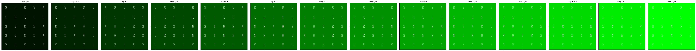

# Image Differences

Demonstrates the process of filling color channels in a digital image. It provides a visual representation of how different color combinations are created using the RGB color model.

## Examples

Examples of how to use the function:

```python
# Red gradient
fill_color_channel(3, 'red')

# Green gradient
fill_color_channel(3, 'green')

# Blue gradient
fill_color_channel(3, 'blue')

# Yellow gradient (Red + Green)
fill_color_channel(3, 'red green')

# Purple gradient (Red + Blue)
fill_color_channel(3, 'red blue')

# Cyan gradient (Green + Blue)
fill_color_channel(3, 'green blue')

# White/Gray gradient (Red + Green + Blue)
fill_color_channel(3, 'red green blue')
```

## Output (Without Matricies)

Below are examples of the output for different color combinations:

### Red Gradient


### Green Gradient


### Blue Gradient


### Yellow Gradient (Red + Green)


### Purple Gradient (Red + Blue)


### Cyan Gradient (Green + Blue)


### White/Gray Gradient (Red + Green + Blue)


## Output (With Matricies)

Below are examples of the output for different color combinations in the matrix combination:

### Red Gradient


### Green Gradient


### Blue Gradient


### Yellow Gradient (Red + Green)


### Purple Gradient (Red + Blue)


### Cyan Gradient (Green + Blue)


### White/Gray Gradient (Red + Green + Blue)


These visualizations help to understand how digital images are composed of separate color channels, and how these channels combine to create different colors.

## Note

- The program creates images of size 64x64 pixels.
- Color values range from 0 (no color) to 1 (full color intensity).
- When multiple channels are chosen, they mix to create new colors.

Feel free to experiment with different combinations of colors and number of steps to see how the gradients change!
## Detailed Explanation

### Image Array and Axes

1. Image Array (I):
    - Shape: (64, 64, 3)
    - First axis (64): Represents the height of the image (64 pixels)
    - Second axis (64): Represents the width of the image (64 pixels)
    - Third axis (3): Represents the color channels (Red, Green, Blue)

2. Color Channels:
    - I[:,:,0]: Red channel
    - I[:,:,1]: Green channel
    - I[:,:,2]: Blue channel

3. Color Values:
    - Range from 0 (no color) to 1 (full color intensity)
    - In each step, we fill the chosen channels with i/n, where i is the current step
      and n is the total number of steps. This creates a gradual fill effect.

4. Displayed Images:
    - We create n subplots, each showing the image at a different step of the process
    - The x-axis of each subplot represents the width of the image
    - The y-axis of each subplot represents the height of the image
    - Color intensity is represented by the values in the color channels

5. Color Mixing:
    - When multiple channels are chosen, they mix to create new colors:
        * Red + Green = Yellow
        * Red + Blue = Purple
        * Green + Blue = Cyan
        * Red + Green + Blue = White (or shades of gray)

This visualization helps to understand how digital images are composed of
separate color channels, and how these channels combine to create different colors.

### Color Representation

In digital images, we use the RGB (Red, Green, Blue) color model. The idea behind this model is that any color can be created by combining different amounts of red, green, and blue. Here's why the third axis represents color:

1. Array Structure:
   When we represent an image in a computer, we use a 3-dimensional array. In our case, the array is of size (64, 64, 3).

2. Meaning of the Axes:
    - The first axis (64): Represents the height of the image in pixels.
    - The second axis (64): Represents the width of the image in pixels.
    - The third axis (3): Represents the color channels.

3. Why the Third Axis Represents Color:
    - Index 0 in the third axis represents the intensity of red.
    - Index 1 in the third axis represents the intensity of green.
    - Index 2 in the third axis represents the intensity of blue.

   In other words, for each pixel in the image (represented by a pair of coordinates in the first and second axes), we have three values that represent the intensity of each primary color.

4. Example:
   If we have a pixel at coordinates (10, 20), then:
    - I[10, 20, 0] represents the intensity of red in this pixel.
    - I[10, 20, 1] represents the intensity of green in this pixel.
    - I[10, 20, 2] represents the intensity of blue in this pixel.

5. Advantages of this Representation:
    - It allows us to control each color channel separately.
    - We can create any color by combining these three channels.
    - It corresponds to how many displays and screens work, which use red, green, and blue sub-pixels to create colors.

6. Value Range:
   We use values between 0 and 1 for each color channel. 0 represents the absence of color, and 1 represents the maximum intensity of the color.

