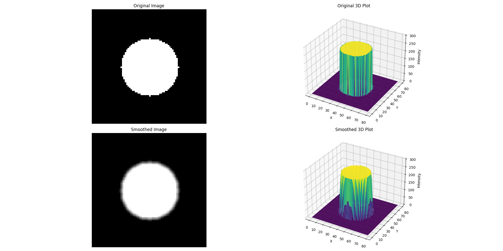
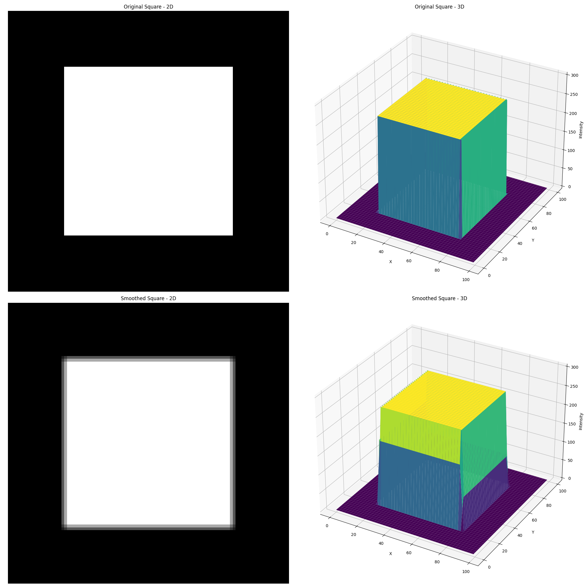
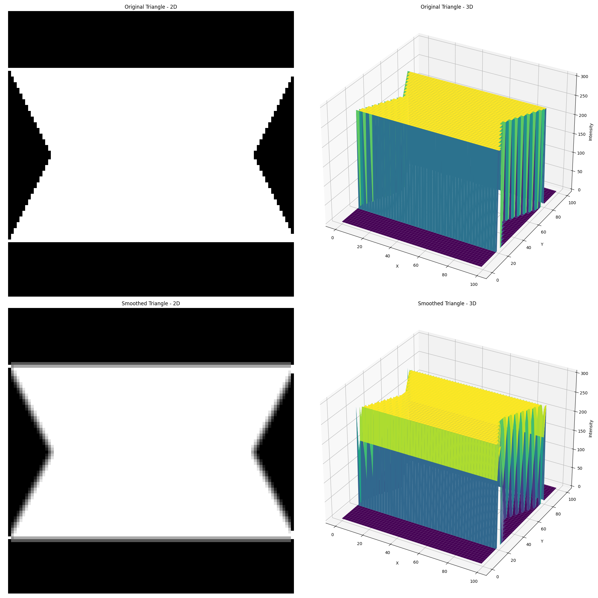
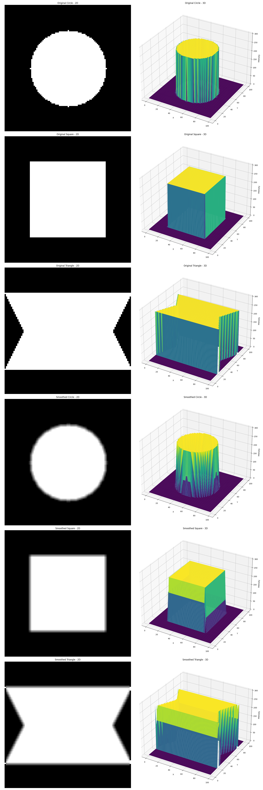

# Image Smoothing 

This project demonstrates various image processing techniques, including the creation of geometric shapes and the application of a smoothing algorithm.

## Overview

This project showcases the creation of basic geometric shapes (circle, square, and triangle) as binary images and applies a smoothing algorithm to these shapes. The process is visualized using both 2D and 3D representations.

## Shapes

### Circle

### Square

### Triangle

## Smoothing Algorithm

The smoothing algorithm uses a 3x3 average filter. For each pixel $(i,j)$ in the image, it calculates the average intensity of the 3x3 neighborhood centered at $(i,j)$.

## Results

The project displays the original and smoothed versions of each shape, along with 3D representations of the intensity values.

## Abstraction

### Shape Creation

1. **Circle**: A pixel $(x,y)$ is part of the circle if:

   $x^2 + y^2 \leq r^2$

   where $r$ is the radius of the circle.

2. **Square**: A pixel $(x,y)$ is part of the square if:

   $|x - c_x| \leq \frac{s}{2}$ and $|y - c_y| \leq \frac{s}{2}$

   where $(c_x, c_y)$ is the center of the image and $s$ is the side length of the square.

3. **Triangle**: For an equilateral triangle, a pixel $(x,y)$ is part of the triangle if:

   $2|x - c_x| - |y - c_y| \leq s$ and $-\frac{h}{2} \leq y - c_y \leq \frac{h}{2}$

   where $(c_x, c_y)$ is the center of the image, $s$ is the side length of the triangle, and $h = s\frac{\sqrt{3}}{2}$ is the height of the triangle.

### Smoothing Algorithm

The smoothing algorithm applies the following operation to each pixel $(i,j)$:

$$I'(i,j) = \frac{1}{9} \sum_{k=-1}^1 \sum_{l=-1}^1 I(i+k, j+l)$$

where $I$ is the original image and $I'$ is the smoothed image.

This operation replaces each pixel's intensity with the average intensity of its 3x3 neighborhood.

